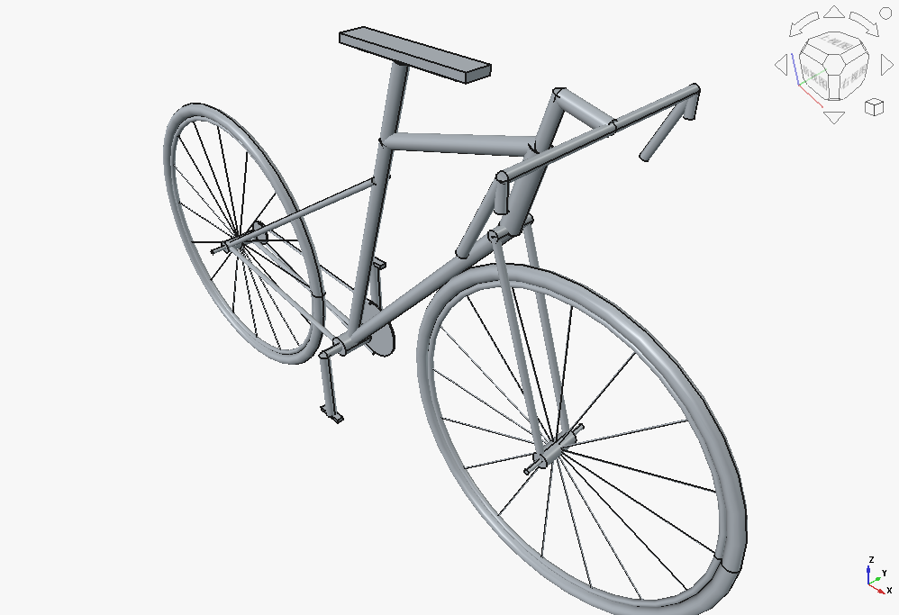
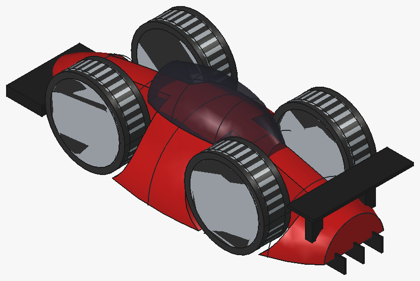

# CADPilot

**English** | [Chinese](README.zh-CN.md)

**AI pilots FreeCAD.** CADPilot is an MCP (Model Context Protocol) server that gives AI clients (Cherry Studio, Claude Code, ZCode, Kimi Code, Claude Desktop, …) full control of [FreeCAD](https://www.freecad.org/): create documents, build constrained sketches, run parametric features, assemble parts with persistent joints, and verify geometry — all via tool calls over XML-RPC.

## Showcase

Models built by the AI through CADPilot — demo files live in [`examples/`](examples/):

| Modern Bicycle (uncolored) | Sports Car (colored) |
| :---: | :---: |
| [](examples/ModernBicycle.FCStd) | [](examples/SportsCar.FCStd) |

## Features

* **Parametric modeling, end to end** — spreadsheet-driven variables, fully constrained sketches, PartDesign features (pad/pocket/revolution/…), dress-up ops, and a multi-view 2D→3D visual hull, all through one unified `cad()` tool.
* **Step journal & review loop** — every mutation is also journaled on the FreeCAD side and shown in the **Steps panel** dock: run planned steps, accept the good ones (soft lock), reject or roll back the rest, edit parameters in place, and replay the whole build from the journal. `execute_code` is a first-class citizen: a snippet that changes the model is wrapped in a transaction and becomes a rollback-able, replayable step, while a read-only inspection never blocks a rollback. Hand edits in the GUI sync back into the recorded steps; `session_rollback` remains for whole-session undo.
* **Persistence** — sessions, patterns, and settings survive restarts as JSON under `~/.cadpilot/`; pause a session today, resume it tomorrow.
* **Geometry sensing** — measure volumes/areas, inspect face/edge topology, and check interference after every step; quantitative feedback replaces guesswork on complex models.
* **Data-driven assembly** — named anchors, residual-checked mates, connectivity audits, and persistent joints (FreeCAD 1.1 Assembly workbench) with declarative priority trimming.
* **Workflow memory** — successful modeling recipes are stored as reusable patterns and recalled on demand; the agent gets better the more you use it.
* **Built-in troubleshooting** — the `diagnose` tool probes the RPC port, the FreeCAD process, the addon install and its logs on Windows/macOS/Linux and ends with a concrete fix — and it works while FreeCAD is down or frozen. `get_addon_log` reads the addon's debug ring buffer even when the GUI is wedged.
* **Token-friendly** — text-first responses with opt-in screenshots (768 px cap), a tiny tool surface, and on-demand operation docs keep context usage low.

## Installation

### Step 1: Install the FreeCAD addon

FreeCAD addon directory:

* Windows:
  * FreeCAD 1.1: `%APPDATA%\FreeCAD\v1-1\Mod\`
  * FreeCAD 1.0: `%APPDATA%\FreeCAD\Mod\`
* macOS:
  * FreeCAD 1.1: `~/Library/Application Support/FreeCAD/v1-1/Mod/`
  * FreeCAD 1.0: `~/Library/Application Support/FreeCAD/v1-0/Mod/`
* Linux:
  * Ubuntu: `~/.FreeCAD/Mod/` or `~/snap/freecad/common/Mod/` (snap installs)
  * Debian: `~/.local/share/FreeCAD/Mod`
  * Arch / CachyOS (FreeCAD 1.1 from `extra/freecad`): `~/.local/share/FreeCAD/v1-1/Mod/`

Copy the `addon/CADPilot` directory into the addon directory:

```bash
git clone https://github.com/LBurny/cadpilot.git
cd cadpilot

# Linux (Ubuntu/Debian)
mkdir -p ~/.FreeCAD/Mod/
cp -r addon/CADPilot ~/.FreeCAD/Mod/

# macOS (FreeCAD 1.1)
mkdir -p ~/Library/Application\ Support/FreeCAD/v1-1/Mod/
cp -r addon/CADPilot ~/Library/Application\ Support/FreeCAD/v1-1/Mod/

# Windows (PowerShell, FreeCAD 1.1)
Copy-Item -Recurse addon/CADPilot "$env:APPDATA\FreeCAD\v1-1\Mod\"
```

Restart FreeCAD, select **CADPilot** from the workbench list, and start the RPC server with the **Start RPC Server** command in the **CADPilot** toolbar. To start it automatically on every launch, enable **Auto-Start Server** in the **CADPilot** menu.

### Step 2: Install the MCP server

#### Option A: PyPI (recommended)

With [uv](https://docs.astral.sh/uv/getting-started/installation/) installed, no explicit install is needed — `uvx` fetches the package from PyPI on first use:

```bash
uvx cadpilot
```

Or with pip: `pip install cadpilot`

#### Option B: From source

```bash
git clone https://github.com/LBurny/cadpilot.git
cd cadpilot
uv sync
```

Then use this MCP client configuration instead of the one below — **replace `/path/to/cadpilot` with the actual clone path** (`--no-sync` skips the editable rebuild on every launch, which would fail while another server instance is running):

```json
{
  "mcpServers": {
    "cadpilot": {
      "command": "uv",
      "args": ["--directory", "/path/to/cadpilot", "run", "--no-sync", "cadpilot"]
    }
  }
}
```

The server speaks MCP on stdio and connects to FreeCAD's XML-RPC addon on `localhost:9875` — you normally don't run it by hand; your AI client launches it via the configuration below.

## Client setup

All MCP clients that support stdio servers use the same configuration — **command** `uvx`, **args** `["cadpilot"]`. Paste this snippet into your client's MCP configuration (Claude Code, Kimi Code, Cherry Studio, ZCode, Claude Desktop, Cursor, …):

```json
{
  "mcpServers": {
    "cadpilot": {
      "command": "uvx",
      "args": ["cadpilot"]
    }
  }
}
```

### Startup options

Tool responses are text-only by default — screenshots are opt-in per call (`with_screenshot=true`) or via the `get_view` tool, which keeps token usage low. Startup flags:

* `--with-screenshots`: attach a screenshot to every mutation/read tool response (for multimodal models)
* `--only-text-feedback`: never return screenshots, even when requested (hard guarantee for text-only models)
* `--host <ip>`: connect to a FreeCAD instance on another machine
* `--no-auto-audit`: skip the connectivity audit after each mutation (for very large models)

```json
{
  "mcpServers": {
    "cadpilot": {
      "command": "uvx",
      "args": ["cadpilot", "--with-screenshots"]
    }
  }
}
```

## Remote connections

By default the RPC server listens on `localhost` only. To control FreeCAD from another machine:

1. In the **CADPilot** toolbar, enable **Remote Connections** (the server binds to `0.0.0.0` on next restart) and click **Configure Allowed IPs** to enter a comma-separated list of allowed IP addresses or CIDR subnets, e.g. `192.168.1.100, 10.0.0.0/24`. Only listed addresses can connect; restart the RPC server after changing settings.
2. Point the MCP server at that machine: `"args": ["cadpilot", "--host", "192.168.1.100"]`.

## Troubleshooting

Something not talking? Ask the AI to run the **`diagnose`** tool — it checks the RPC port, the FreeCAD process, the addon install and its logs (Windows/macOS/Linux) and ends with a concrete fix, and it works even when FreeCAD is frozen or not running. The two rules that solve most cases:

1. Addon changes load only at startup — **restart FreeCAD** after installing or updating the addon.
2. The MCP tool list is built at startup — **restart the MCP client** after changing the server config or version.

## Tools

* **`cad`** — unified CAD mutation tool: `create_object` / `edit_object` / `delete_object` / `batch`, parametric feature ops (`boolean` / `fillet` / `chamfer` / `loft` / `sweep` / `mirror` / `pattern` / `move`), Sketcher/PartDesign ops (`variables` / `sketch` / `pad` / `pocket` / `revolution` / `groove` / `thickness` / `draft` / `datum_plane` / `hull`). Edge/face selectors are fed by `get_topology`; every mutation is transactional and rollback-able.
* **`execute_code` / `execute_code_async` / `get_task_result`** — run arbitrary Python in FreeCAD (GUI-thread safe), or background-safe code for long OCCT computations with polling. A run that changes the document is transactional, so it rolls back and replays like any other step; a failing snippet is rolled back cleanly.
* **Modeling sessions** — `session_start` / `session_status` / `session_get_steps` / `session_rollback` / `session_redo` / `session_add_note` / `session_pause` / `session_resume` / `session_list` / `session_complete`: step recording with rollback via FreeCAD's native transaction undo.
* **Step journal** — `step_control` drives the FreeCAD-side review loop shared with the Steps panel: `run_next` / `run_all` / `rollback_to` / `reexecute` / `accept` / `reject` / `update` / `insert` / `replay` / `snapshot`. The journal lives on the document itself, so the panel works even with the RPC server stopped.
* **Knowledge hierarchy** — `save_pattern` / `recall_patterns` (reusable workflow memory), `inspect_freecad` (runtime API introspection), `operation_help` (per-operation reference docs).
* **Geometry sensing** — `measure_geometry` / `get_topology` / `check_interference` / `get_positioning_info`: quantitative feedback after each modeling step.
* **Assembly** — `get_anchors` / `set_anchors` / `assemble` / `align_shapes` / `verify_assembly` for data-driven spatial positioning; `assembly_session` for mate-based assembly with persistent joints (FreeCAD 1.1 Assembly workbench) and declarative priority trimming.
* **Documents & views** — `create_document` / `list_documents` / `get_objects` / `get_object` / `get_view` (screenshots capped at 768 px on the long edge by default).
* **Diagnostics** — `diagnose` (cross-platform fault probing that works with FreeCAD down) and `get_addon_log` (the addon's ring-buffer debug log, readable while the GUI is wedged).

See the [design document](docs/DESIGN.md) for the architecture behind these tools, and try the demo model [`examples/ModernBicycle.FCStd`](examples/ModernBicycle.FCStd) in FreeCAD.

## Documentation

* MCP design document: [English](docs/DESIGN.md) | [Chinese](docs/DESIGN.zh-CN.md)
* [Changelog](CHANGELOG.md)

## Development

```bash
git clone https://github.com/LBurny/cadpilot.git
cd cadpilot
uv sync
uv run pytest          # run the test suite
uv run ruff check .    # lint
uv run cadpilot        # run the MCP server from source
```

## Acknowledgments

This project was originally based on [neka-nat/freecad-mcp](https://github.com/neka-nat/freecad-mcp) by Shirokuma (k tanaka) — many thanks to the original authors; parts of this project are derived from their work (MIT License).

## License

MIT — see [LICENSE](./LICENSE).
