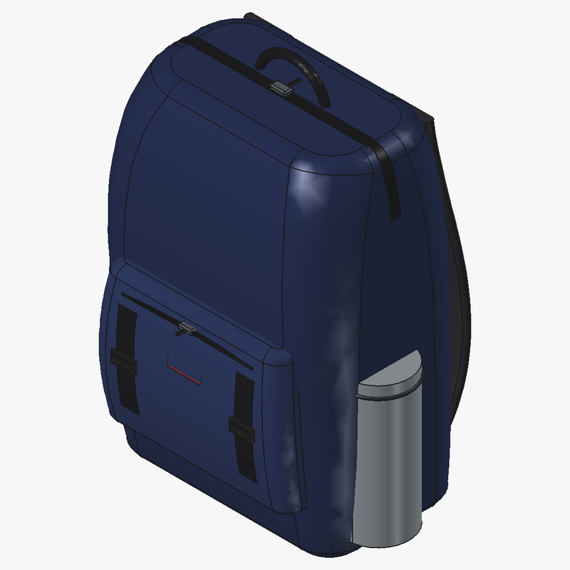
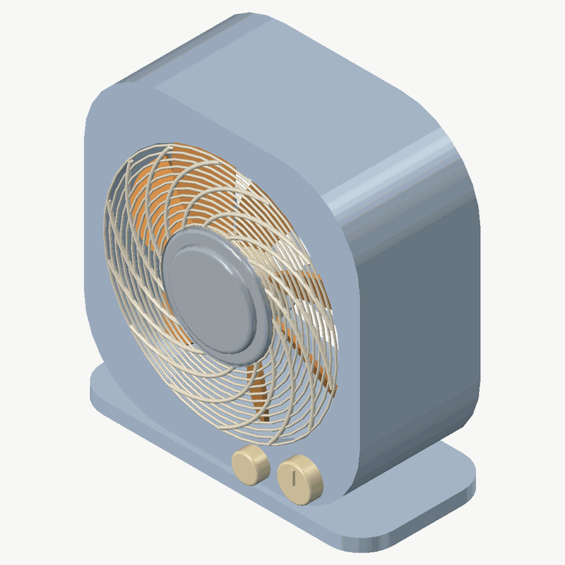

# CADPilot

[English](README.md) | **简体中文**

**AI 驾驶 FreeCAD。** CADPilot 是一个 MCP（Model Context Protocol）服务器，让 AI 客户端（Cherry Studio、Claude Code、ZCode、Kimi Code、Claude Desktop 等）完全掌控 [FreeCAD](https://www.freecad.org/)：创建文档、构建全约束草图、运行参数化特征、以持久化关节装配零件、验证几何 —— 全部通过 XML-RPC 上的工具调用完成。

## 效果展示

AI 通过 CADPilot 构建的模型 —— 演示文件位于 [`examples/`](examples/)：

| 双肩包 | 台式风扇 |
| :---: | :---: |
| [](examples/Backpack.FCStd) | [](examples/DeskFan.FCStd) |
| **小提琴** | **树叶** |
| [](examples/Violin.FCStd) | [](examples/Leaf.FCStd) |

## 特点

* **端到端参数化建模** —— 电子表格变量驱动、全约束草图、PartDesign 特征（pad/pocket/revolution 等）、修饰操作、多视图 2D→3D 视觉外壳，全部收敛在一个统一的 `cad()` 工具里。
* **步骤日志与评审循环** —— 每个变更同时记录在 FreeCAD 侧的日志里，并显示在 **Steps 面板**中：按计划执行、接受好的步骤（软锁）、拒绝或回滚其余、就地修改参数、从日志整体 replay 重建。`execute_code` 是一等公民：改动模型的片段会被包进事务，成为可回滚、可重放的步骤；只读检查则永不阻塞回滚。在 GUI 里的手工修改会同步回步骤记录；`session_rollback` 仍用于整个会话的撤销。
* **持久化** —— 会话、模式与设置以 JSON 存于 `~/.cadpilot/`，重启不丢；今天暂停的会话，明天接着做。
* **几何感知** —— 每步之后测量体积/面积、检查面/边拓扑、检测干涉；复杂建模时用定量反馈取代猜测。
* **数据驱动装配** —— 命名锚点、带残差校验的配合、连通性审计，以及持久化关节（FreeCAD 1.1 Assembly 工作台）与声明式优先级裁剪。
* **工作流记忆** —— 成功的建模套路存为可复用模式，按需召回；越用越聪明。
* **内置故障诊断** —— `diagnose` 工具在 Windows/macOS/Linux 上探测 RPC 端口、FreeCAD 进程、插件安装与日志，并给出具体修复建议 —— FreeCAD 卡死或未启动时也能用。`get_addon_log` 在 GUI 卡死时仍能读取插件的调试环形日志。
* **省 token** —— 文本优先响应、截图按需开启（512px 封顶）、精简的工具面、按需获取的操作文档，上下文占用极低。

## 安装

### 第一步：安装 FreeCAD 插件

FreeCAD 插件目录：

* Windows：
  * FreeCAD 1.1：`%APPDATA%\FreeCAD\v1-1\Mod\`
  * FreeCAD 1.0：`%APPDATA%\FreeCAD\Mod\`
* macOS：
  * FreeCAD 1.1：`~/Library/Application Support/FreeCAD/v1-1/Mod/`
  * FreeCAD 1.0：`~/Library/Application Support/FreeCAD/v1-0/Mod/`
* Linux：
  * Ubuntu：`~/.FreeCAD/Mod/` 或 `~/snap/freecad/common/Mod/`（snap 安装）
  * Debian：`~/.local/share/FreeCAD/Mod`
  * Arch / CachyOS（`extra/freecad` 的 FreeCAD 1.1）：`~/.local/share/FreeCAD/v1-1/Mod/`

把 `addon/CADPilot` 目录复制到插件目录：

```bash
git clone https://github.com/LBurny/cadpilot.git
cd cadpilot

# Linux（Ubuntu/Debian）
mkdir -p ~/.FreeCAD/Mod/
cp -r addon/CADPilot ~/.FreeCAD/Mod/

# macOS（FreeCAD 1.1）
mkdir -p ~/Library/Application\ Support/FreeCAD/v1-1/Mod/
cp -r addon/CADPilot ~/Library/Application\ Support/FreeCAD/v1-1/Mod/

# Windows（PowerShell，FreeCAD 1.1）
Copy-Item -Recurse addon/CADPilot "$env:APPDATA\FreeCAD\v1-1\Mod\"
```

重启 FreeCAD，从工作台列表选择 **CADPilot**，点击 **CADPilot** 工具栏中的 **Start RPC Server** 启动 RPC 服务器。如需每次启动 FreeCAD 时自动运行，在 **CADPilot** 菜单中勾选 **Auto-Start Server**。

### 第二步：安装 MCP 服务器

#### 方式 A：PyPI（推荐）

安装 [uv](https://docs.astral.sh/uv/getting-started/installation/) 后无需显式安装 —— `uvx` 首次使用时自动从 PyPI 拉取：

```bash
uvx cadpilot
```

或用 pip：`pip install cadpilot`

#### 方式 B：源码安装

```bash
git clone https://github.com/LBurny/cadpilot.git
cd cadpilot
uv sync
```

然后改用下面的 MCP 客户端配置 —— **注意把 `/path/to/cadpilot` 替换成实际的克隆路径**（`--no-sync` 跳过每次启动时的 editable 重建 —— 当有其他服务器实例正在运行时，重建会因 exe 被锁定而失败）：

```json
{
  "mcpServers": {
    "cadpilot": {
      "command": "uv",
      "args": ["--directory", "/path/to/cadpilot", "run", "--no-sync", "cadpilot"]
    }
  }
}
```

服务器通过 stdio 讲 MCP 协议，并连接 FreeCAD 插件在 `localhost:9875` 上的 XML-RPC 服务 —— 通常不需要手动运行，AI 客户端会通过下面的配置自动启动它。

## 客户端配置

所有支持 stdio 的 MCP 客户端使用同一份配置 —— **command** 为 `uvx`，**args** 为 `["cadpilot"]`。把下面的 JSON 片段粘贴到你所用客户端的 MCP 配置中（Claude Code、Kimi Code、Cherry Studio、ZCode、Claude Desktop、Cursor 等）：

```json
{
  "mcpServers": {
    "cadpilot": {
      "command": "uvx",
      "args": ["cadpilot"]
    }
  }
}
```

### 启动选项

工具响应默认纯文本 —— 截图按需开启（单次调用传 `with_screenshot=true` 或用 `get_view` 工具），token 占用低。启动参数：

* `--with-screenshots`：每个变更/读取类工具响应都附带截图（适合多模态模型）
* `--only-text-feedback`：永不返回截图，即使调用方请求（纯文本模型的硬保证）
* `--screenshot-mode file`：把截图保存到 `~/.cadpilot/screenshots/` 下，只返回文件路径而不是内联 base64 图片（对具备文件读取工具的 agent 客户端省得多；默认为 `image`）
* `--host <ip>`：连接另一台机器上的 FreeCAD 实例
* `--no-auto-audit`：跳过每次变更后的连通性审计（超大模型用）

```json
{
  "mcpServers": {
    "cadpilot": {
      "command": "uvx",
      "args": ["cadpilot", "--with-screenshots"]
    }
  }
}
```

## 远程连接

RPC 服务器默认只监听 `localhost`。要从局域网内另一台机器控制 FreeCAD：

1. 在 **CADPilot** 工具栏勾选 **Remote Connections**（下次重启后绑定 `0.0.0.0`），并点击 **Configure Allowed IPs** 输入允许连接的 IP 或 CIDR 网段（逗号分隔），例如 `192.168.1.100, 10.0.0.0/24`。只有列出的地址可以连接；修改设置后需重启 RPC 服务器。
2. 让 MCP 服务器指向该机器：`"args": ["cadpilot", "--host", "192.168.1.100"]`。

## 故障排查

连不上？让 AI 跑一下 **`diagnose`** 工具 —— 它会检查 RPC 端口、FreeCAD 进程、插件安装与日志（Windows/macOS/Linux），最后给出具体的修复步骤，FreeCAD 卡死或未启动时也能用。两条能解决大多数问题的规则：

1. 插件改动只在启动时加载 —— 安装或更新插件后**重启 FreeCAD**。
2. MCP 工具列表在启动时构建 —— 修改服务器配置或版本后**重启 MCP 客户端**。

## 工具

* **`cad`** —— 统一 CAD 变更工具：`create_object` / `edit_object` / `delete_object` / `batch`，参数化特征（`boolean` / `fillet` / `chamfer` / `loft` / `sweep` / `mirror` / `pattern` / `move`），Sketcher/PartDesign 操作（`variables` / `sketch` / `pad` / `pocket` / `revolution` / `groove` / `thickness` / `draft` / `datum_plane` / `hull`）。边/面选择器由 `get_topology` 提供；每个变更都在事务内执行、可回滚。
* **`execute_code` / `execute_code_async` / `get_task_result`** —— 在 FreeCAD 中执行任意 Python（GUI 线程安全），或对耗时 OCCT 计算使用后台执行 + 轮询。改动文档的运行是事务化的，因此与其它步骤一样可回滚、可重放；失败的片段会被干净回滚。
* **建模会话** —— `session_start` / `session_status` / `session_get_steps` / `session_rollback` / `session_redo` / `session_add_note` / `session_pause` / `session_resume` / `session_list` / `session_complete`：步骤记录 + 基于 FreeCAD 原生事务撤销的回滚。
* **步骤日志** —— `step_control` 驱动与 Steps 面板共享的 FreeCAD 侧评审循环：`run_next` / `run_all` / `rollback_to` / `reexecute` / `accept` / `reject` / `update` / `insert` / `replay` / `snapshot`。日志存在文档上，RPC 服务器停掉时面板照常工作。
* **知识层级** —— `save_pattern` / `recall_patterns`（可复用工作流记忆）、`inspect_freecad`（运行时 API 内省）、`operation_help`（按需获取操作参考文档）。
* **几何感知** —— `measure_geometry` / `get_topology` / `check_interference` / `get_positioning_info`：每步建模后的定量反馈。
* **装配** —— `get_anchors` / `set_anchors` / `assemble` / `align_shapes` / `verify_assembly` 提供数据驱动的空间定位；`assembly_session` 提供基于配合的装配状态机（FreeCAD 1.1 Assembly 工作台持久化关节）与声明式优先级裁剪。
* **文档与视图** —— `create_document` / `list_documents` / `get_objects` / `get_object` / `get_view`（截图默认长边 512px 封顶，节省 token）。
* **诊断** —— `diagnose`（跨平台故障探测，FreeCAD 未启动也能用）与 `get_addon_log`（插件的环形调试日志，GUI 卡死时仍可读）。

这些工具背后的架构见[设计文档](docs/DESIGN.zh-CN.md)；可在 FreeCAD 中打开演示模型 [`examples/Backpack.FCStd`](examples/Backpack.FCStd) 试用。

## 文档

* MCP 设计文档：[English](docs/DESIGN.md) | [中文](docs/DESIGN.zh-CN.md)
* [更新日志](CHANGELOG.md)

## 开发

```bash
git clone https://github.com/LBurny/cadpilot.git
cd cadpilot
uv sync
uv run pytest          # 运行测试套件
uv run ruff check .    # 代码检查
uv run cadpilot        # 从源码运行 MCP 服务器
```

## 致谢

本项目最初基于 [neka-nat/freecad-mcp](https://github.com/neka-nat/freecad-mcp)（作者 Shirokuma (k tanaka)）开发 —— 非常感谢原作者的工作，本项目部分内容参考并衍生自该项目（MIT License）。

## 许可证

MIT —— 见 [LICENSE](./LICENSE)。
